# Part 2: TrueSkill Demystified

*How Xbox matchmaking became my pendant-ranking superpower*

---

## A Brief History of Skill Rating

Before we dive into TrueSkill, let's talk about its predecessor: **Elo**.[^1]

Invented in the 1960s by Hungarian-American physics professor Arpad Elo, the Elo rating system revolutionized chess rankings. The core idea is beautifully simple:

1. Every player has a rating (a single number)
2. When two players compete, the expected outcome depends on their rating difference
3. After the match, ratings shift toward the surprising direction

If a 1500-rated player beats a 1600-rated player, both ratings adjust. The upset winner gains points; the upset loser drops points. Over time, ratings converge to true skill levels.

But Elo has problems:

- **New players are chaos**: Someone who just joined could be a grandmaster or a beginner. Elo doesn't know.
- **No uncertainty tracking**: A player with 1500 rating after 1000 games is *very* different from 1500 after 3 games.
- **Draws are awkward**: The original system wasn't designed for ties.

In 2007, Microsoft Research unveiled **TrueSkill**[^2] to solve these problems for Xbox Live matchmaking. It would go on to power Halo, Gears of War, and countless other games.

And it turns out to be perfect for ranking pendants.

---

## The Bayesian Mindset

TrueSkill is a **Bayesian** rating system.[^3] That's a fancy way of saying it keeps track of both **what we believe** and **how confident we are** in that belief.

In traditional Elo, a player has one number: their rating. In TrueSkill, every player (or pendant) has *two* numbers:

| Symbol | Name | Meaning |
|--------|------|---------|
| $\mu$ | Mean | Our best guess at the item's appeal to you |
| $\sigma$ | Standard deviation | How uncertain we are about that guess |

When you first add a pendant to the system, we know nothing about it:

```python
# Default TrueSkill values
μ = 25.0   # Middle of the appeal range
σ = 8.333  # Very uncertain (σ = μ/3)
```

That high $\sigma = 8.333$ is TrueSkill's way of saying: "I have no idea how much you'll like this pendant. It could be your favorite or your least favorite."

```mermaid
---
title: "Figure 1: Initial Belief State"
---
graph LR
    subgraph "New Pendant"
        A["μ = 25.0<br/>σ = 8.333"]
    end
    
    subgraph "Belief Distribution"
        B["🔔 Wide bell curve<br/>Could be anywhere from ~0 to ~50"]
    end
    
    A --> B
```



*Figure 1: When a pendant first enters the system, we model our uncertainty as a wide Gaussian distribution centered at $\mu = 25$ with standard deviation $\sigma = 8.333$.*

---

## How Uncertainty Shrinks

Here's where the magic happens. Every time two pendants are compared, **both** of their uncertainties shrink.

It's like this: if I show you pendants A and B, and you pick A, I've learned something about *both*:

- A is probably better than I thought (if it was uncertain)
- B is probably worse than I thought (if it was uncertain)

And crucially, **I'm now more confident about both**, regardless of who won.

```mermaid
---
title: "Figure 2: Belief Update After a Comparison"
---
flowchart TD
    subgraph Before["Before Comparison"]
        A1["Pendant A<br/>μ = 25.0, σ = 8.3"]
        B1["Pendant B<br/>μ = 25.0, σ = 8.3"]
    end
    
    Compare["You choose: A > B"]
    
    subgraph After["After Comparison"]
        A2["Pendant A<br/>μ = 29.4, σ = 6.5 ⬇️"]
        B2["Pendant B<br/>μ = 20.6, σ = 6.5 ⬇️"]
    end
    
    A1 --> Compare
    B1 --> Compare
    Compare --> A2
    Compare --> B2
    
    style A2 fill:#90EE90
    style B2 fill:#FFB6C1
```



*Figure 2: A single comparison updates both pendants. Your preference for A increases its $\mu$, B's decreases, and crucially—both $\sigma$ values shrink, indicating increased confidence about your taste.*

After just one comparison:

- **$\mu$ values diverge**: Your preferred item's $\mu$ goes up, the other's goes down
- **$\sigma$ values shrink for both**: We're more confident about your preferences

This is the power of Bayesian inference.[^3] We don't just update "who won"—we update our entire belief about how much each pendant appeals to you.

---

## The Update in Code

The update logic is straightforward:

```python
# Pseudo-code for rating update
ratingL, ratingR = create_ratings(pendantL, pendantR)
if user_chose_left:
    new_ratingL, new_ratingR = trueskill.rate_1vs1(ratingL, ratingR)
else:
    new_ratingR, new_ratingL = trueskill.rate_1vs1(ratingR, ratingL)
# Save updated μ and σ to database
```

The `trueskill.rate_1vs1()` function does all the heavy Bayesian lifting—taking prior beliefs ($\mu$, $\sigma$) for both items, incorporating the observed outcome, and returning updated posteriors. Under the hood, it's doing **Gaussian belief propagation** via message passing on a factor graph.[^2]

*(See `update_ratings()` in `backend/rating.py` for the full implementation)*

---

## The Conservative Score

Now here's a subtle problem: what if a pendant gets lucky?

Imagine pendant X has only been compared once, and it won. Its rating might now be:

- $\mu = 29.4$ (looks like you love it!)
- $\sigma = 6.5$ (still pretty uncertain)

Meanwhile, pendant Y has been compared 20 times and won 15 of them:

- $\mu = 32.1$ (higher!)  
- $\sigma = 2.1$ (very confident)

If we sort by $\mu$ alone, pendant Y ranks higher. Good.

But what if pendant X just happened to beat a weak opponent in that one comparison? With $\sigma = 6.5$, there's a decent chance its true appeal to you is actually much lower than 29.4.

**Solution: the conservative score.**

$$
\text{Conservative Score} = \mu - 3\sigma
$$

Using $k = 3$ gives us roughly a 99.7% confidence lower bound—a pessimistic but stable ranking metric.

*(See `conservative_score()` in `backend/pendant.py`)*

```mermaid
---
title: "Figure 3: Conservative Score Comparison"
---
graph LR
    subgraph Lucky["Pendant X (Lucky Newcomer)"]
        X["μ = 29.4, σ = 6.5<br/>Score: 29.4 - 19.5 = <b>9.9</b>"]
    end
    
    subgraph Proven["Pendant Y (Battle-Tested)"]
        Y["μ = 32.1, σ = 2.1<br/>Score: 32.1 - 6.3 = <b>25.8</b>"]
    end
    
    X --> R["Ranking by Conservative Score"]
    Y --> R
    R --> W["Y wins! 25.8 > 9.9"]
    
    style Y fill:#90EE90
    style X fill:#FFB6C1
```



*Figure 3: The conservative score penalizes uncertainty. Pendant Y, with lower uncertainty ($\sigma = 2.1$), outranks the "lucky" Pendant X despite a lower mean appeal estimate.*

The conservative score penalizes uncertainty. An item has to *prove* its appeal through multiple comparisons—one lucky win isn't enough.

This is exactly what we want for the leaderboard. The top pendants should be ones we're **confident** you like, not just ones that got lucky in their first comparison.

Another way to think about $\mu - 3\sigma$: it represents an appeal level **this item is almost certainly not less attractive to you than**. Out of all possible appeal values (remember, the Gaussian bell curve extends infinitely), 99.7% of the probability mass lies above this conservative estimate. It's a pessimistic but stable number for comparison.

---

## When Surprises Happen: Update Magnitudes

Not all comparisons are equally informative. When something expected happens, TrueSkill makes small adjustments. When something unexpected happens—a surprise—the updates are much larger.

Think about it: if the pendant with $\mu = 30$ beats the pendant with $\mu = 20$, that confirms what we already believed about your preferences. The ratings might shift slightly, but not dramatically. Both uncertainties shrink a bit since we gathered more evidence.

But if the $\mu = 20$ pendant *wins* against the $\mu = 30$ pendant? That's surprising! TrueSkill responds with larger updates:

- The underdog's $\mu$ jumps up significantly (you like it more than we thought!)
- The favorite's $\mu$ drops noticeably (maybe it's not as appealing to you as we believed)
- Both $\sigma$ values still shrink (we learned something definitive about your taste)

This adaptive behavior means TrueSkill learns faster from surprising choices. When a new pendant enters and you prefer it over several established favorites, the algorithm quickly recognizes: "This appeals strongly to this person—adjust accordingly!" The uncertainty ($\sigma$) also shrinks faster because decisive preferences provide strong evidence about your taste.

---

## Draws and Close Matches

Real preferences aren't always black and white. Sometimes two pendants are so close that you genuinely can't decide. That's okay—TrueSkill handles draws.

When you declare a draw, TrueSkill treats it as evidence that the items are close in appeal to you. This:

- **Pulls $\mu$ values toward each other** (if they were different)
- **Shrinks $\sigma$ for both** (we still learned something!)

The `draw_probability` parameter in our environment (set to 0.10) tells TrueSkill how common we expect draws to be. This affects how much information a draw conveys.

---

## The Full Update Flow

Here's the complete picture of what happens during a single comparison:

```mermaid
---
title: "Figure 4: Complete Match Processing Flow"
---
flowchart TD
    Start["User sees two pendants"] --> Choice
    
    Choice{"User's decision"}
    Choice -->|"Left is better"| LeftWins["Outcome: L"]
    Choice -->|"Right is better"| RightWins["Outcome: R"]
    Choice -->|"Can't decide / Equal"| Draw["Outcome: D"]
    Choice -->|"Neither / Bad pair"| Skip["Outcome: S"]
    
    LeftWins --> Update
    RightWins --> Update
    Draw --> Update
    Skip --> NoUpdate["No rating change"]
    
    Update["TrueSkill Update<br/>rate_1vs1()"]
    
    Update --> NewBeliefs["New μ and σ<br/>for both pendants"]
    
    NewBeliefs --> Persist["Save to database"]
    NoUpdate --> Persist
    
    Persist --> Next["Pick next pair<br/>(Part 3!)"]
    
    style Update fill:#4169E1,color:white
    style NewBeliefs fill:#90EE90
```



*Figure 4: The complete flow from user decision to database persistence. Note that "Skip" doesn't update ratings—it's for pairs where neither option is acceptable or the comparison doesn't make sense.*

---

## The Data We're Collecting

Every comparison creates a record. After a few dozen comparisons, the data looks like this:


*Figure 5: The recent matches panel shows comparison history. Each row displays the two pendants, the outcome (Left/Right/Draw/Skip), and timestamp.*

This raises important questions:

1. **How do we rank items given noisy preferences?** (Solved by conservative score)
2. **Which pairs should we show next?** (Not yet solved)
3. **How do we avoid showing the same pair twice?** (Not yet solved)
4. **What if the user keeps cycling between the same top 2 items?** (Loop hell!)

The TrueSkill algorithm handles #1 beautifully. But picking *which* pairs to compare? That's a separate problem—and it's critical to making this practical.

Let's tackle that in Part 3.

---

## What We've Learned

TrueSkill gives us:

| Feature | Why It Matters |
|---------|---------------|
| **Two numbers ($\mu$, $\sigma$)** | Track both appeal and confidence |
| **Bayesian updates** | Learn from every comparison |
| **Shrinking $\sigma$** | Uncertainty decreases with evidence |
| **Conservative score** | Don't trust lucky first impressions |
| **Draw handling** | "Too close to call" is valid data about your taste |

But we've been glossing over something important: **which pairs should we compare?**

With 237 pendants and limited patience, we can't compare randomly. We need to be smart about which pairs will teach us the most.

That's where active learning comes in. And that's the subject of our final installment.

---

## References

[^1]: Elo, A. E. (1978). *The Rating of Chessplayers, Past and Present*. Arco Publishing.

[^2]: Herbrich, R., Minka, T., & Graepel, T. (2007). "TrueSkill™: A Bayesian Skill Rating System." *Advances in Neural Information Processing Systems*, 19, 569-576. Microsoft Research.

[^3]: Gelman, A., Carlin, J. B., Stern, H. S., Dunson, D. B., Vehtari, A., & Rubin, D. B. (2013). *Bayesian Data Analysis* (3rd ed.). Chapman and Hall/CRC.

---

*Next up: [Part 3 - The Pair Selection Puzzle](./part3-pair-selection-puzzle.md)*

*Previous: [Part 1 - The Pendant Problem](./part1-the-pendant-problem.md)*
