# Part 3: The Pair Selection Puzzle

*How to ask the right questions when you can't ask them all*

---

## The Story So Far

In [Part 1](./part1-the-pendant-problem.md), we established the problem: ranking 237 pendants using pairwise comparisons. In [Part 2](./part2-trueskill-demystified.md), we learned how TrueSkill models each pendant with a belief distribution—$\mu$ for estimated skill, $\sigma$ for uncertainty.

Now comes the crucial question: **which pairs should we compare?**

---

## The Exploration-Exploitation Dilemma

After 20 comparisons, the app knows a few things:

- **Pendant #47** (the rose gold teardrop) has won 6 of 7 matches. It's looking good.
- **Pendant #183** has never been compared. Complete mystery.
- **Pendant #12** has been compared 5 times with mixed results. Medium confidence.

Now, which pair should I see next?

**Option A: Exploit what we know**
Compare #47 against its closest rivals. Refine the top of the ranking. Make sure our current best is actually the best.

**Option B: Explore the unknown**
Compare #183 (never seen!) against something. Maybe it's the hidden gem that beats everything?

This is the classic **exploration-exploitation tradeoff**—one of the most studied problems in machine learning and decision theory.

```mermaid
graph TD
    subgraph Exploit["🎯 Exploit"]
        E1["Compare top contenders"]
        E2["Refine rankings at the top"]
        E3["Risk: Miss hidden gems"]
    end
    
    subgraph Explore["🔍 Explore"]
        X1["Compare uncertain items"]
        X2["Discover new favorites"]
        X3["Risk: Waste time on junk"]
    end
    
    Balance["⚖️ Balance"]
    
    Exploit --> Balance
    Explore --> Balance
    Balance --> Win["Fast convergence<br/>+ No blind spots"]
    
    style Balance fill:#FFD700
```



Lean too hard into exploitation, and you might miss a better option hiding in the unexplored items.

Lean too hard into exploration, and you waste comparisons on items you already know are mediocre.

We need a principled way to balance.

---

## The Naive Approaches (And Why They Fail)

### Random Selection

```python
def choose_next_pair_random(pendants):
    return random.sample(pendants, 2)
```

Simple, but wasteful. We'll often compare:

- Items we already know well (wasted comparison)
- Items that are obviously far apart in skill (uninformative)
- Items we just compared (annoying)

### Round-Robin

```python
def choose_next_pair_round_robin(pendants, match_counts):
    # Pick the two pendants with fewest comparisons
    sorted_by_count = sorted(pendants, key=lambda p: match_counts[p.id])
    return sorted_by_count[0], sorted_by_count[1]
```

Better—ensures every item gets some exposure. But still doesn't account for:

- **Match quality**: Comparing #1 vs #200 teaches us almost nothing
- **Uncertainty**: Some items need more matches than others
- **Diminishing returns**: After 10 matches, another one helps less

### The "Close Match" Heuristic

```python
def choose_next_pair_close(pendants):
    # Pick items with similar ratings
    sorted_by_mu = sorted(pendants, key=lambda p: p.mu)
    # Compare adjacent items in ranking
    best_pair, best_gap = None, float('inf')
    for i in range(len(sorted_by_mu) - 1):
        gap = abs(sorted_by_mu[i].mu - sorted_by_mu[i+1].mu)
        if gap < best_gap:
            best_gap = gap
            best_pair = (sorted_by_mu[i], sorted_by_mu[i+1])
    return best_pair
```

Getting closer! Close matches are informative. But this:

- Ignores uncertainty (σ)
- Gets stuck on the same pairs
- Never explores new items

We can do better. Much better.

---

## EΔσ: Expected Uncertainty Reduction

Here's the key insight from **Bayesian active learning**: we should pick the pair that will teach us the most.

But "teach us the most" is vague. How do we quantify it?

**Answer: measure how much uncertainty will shrink.**

For any pair (i, j), we can compute the **Expected Δσ (EΔσ)**—the expected reduction in total uncertainty after comparing them.

$$
E[\Delta\sigma]_{i,j} = \sum_{y \in \{L, R, D\}} P(y) \cdot \Delta\sigma_y
$$

Where:

- $y$ ranges over possible outcomes: Left wins (L), Right wins (R), Draw (D)
- $P(y)$ is the probability of that outcome
- $\Delta\sigma_y$ is the uncertainty reduction if that outcome occurs

### Computing Outcome Probabilities

TrueSkill gives us a generative model: skills produce noisy performances, and the higher performance wins.

For two pendants with ratings $(μ_L, σ_L)$ and $(μ_R, σ_R)$:

```python
# Probability left wins (ignoring draws)
delta_mu = μ_L - μ_R
denom = √(2β² + σ_L² + σ_R²)  # β is performance noise
p_left_nd = Φ(delta_mu / denom)  # Normal CDF

# Draw probability from match quality
p_draw = quality_1vs1(rating_L, rating_R)

# Final probabilities
p_left = p_left_nd × (1 - p_draw)
p_right = (1 - p_left_nd) × (1 - p_draw)
```

### Hypothetical Updates

For each possible outcome, we simulate what TrueSkill would do:

```python
# What if left wins?
newL_w, newR_w = rate_1vs1(rL, rR, drawn=False)

# What if right wins?
newR_l, newL_l = rate_1vs1(rR, rL, drawn=False)

# What if draw?
newL_d, newR_d = rate_1vs1(rL, rR, drawn=True)
```

### The Expected Reduction

Now we can compute the magic number:

```python
def expected_sigma_reduction(left, right):
    # Current total uncertainty
    sigma_sum = left.sigma + right.sigma
    
    # Reduction under each outcome
    delta_w = sigma_sum - (newL_w.sigma + newR_w.sigma)  # Left wins
    delta_l = sigma_sum - (newL_l.sigma + newR_l.sigma)  # Right wins
    delta_d = sigma_sum - (newL_d.sigma + newR_d.sigma)  # Draw
    
    # Expected reduction
    return p_left * delta_w + p_right * delta_l + p_draw * delta_d
```

### Why EΔσ Works

This formula naturally captures everything we care about:

| Situation | EΔσ Result | Why |
|-----------|------------|-----|
| Both items uncertain (high σ) | **High** | Lots of uncertainty to reduce |
| One item uncertain | **Medium** | Still something to learn |
| Both items well-known (low σ) | **Low** | Not much uncertainty left |
| Close match (similar μ) | **Higher** | Uncertain outcome = balanced learning |
| Lopsided match | **Lower** | One outcome dominates, less total info |

The beauty is that we don't need any heuristic bonuses or special cases. The math just *does the right thing*.

```mermaid
graph TD
    subgraph High["High EΔσ Pairs"]
        H1["Both pendants uncertain"]
        H2["Similar skill levels"]
        H3["→ Compare these first!"]
    end
    
    subgraph Low["Low EΔσ Pairs"]
        L1["Both pendants well-measured"]
        L2["Very different skill levels"]
        L3["→ Skip or defer"]
    end
    
    H1 --> Priority["🎯 Selection Priority"]
    L1 --> Priority
    
    style High fill:#90EE90
    style Low fill:#FFB6C1
```



---

## Thompson Sampling: Randomness as a Feature

EΔσ is powerful, but it has a flaw: it's **deterministic**.

Given the same state, it always picks the same pair. This can lead to:

- Getting stuck in loops
- Over-focusing on a small set of "most informative" pairs
- Missing items that *would* be informative with a little more exploration

Enter **Thompson Sampling**, a beautifully simple algorithm from 1933 (!).

### The Algorithm

1. For each pendant, **sample** a skill value from its posterior distribution
2. Sort all pendants by their sampled skill
3. Look at adjacent pairs (close in sampled skill)
4. Pick the best one

```python
def thompson_sample_pairs(pendants):
    # Sample from each posterior
    samples = {p.id: random.gauss(p.mu, p.sigma) for p in pendants}
    
    # Sort by sampled skill
    sorted_ids = sorted(samples.keys(), key=samples.get, reverse=True)
    
    # Return adjacent pairs as candidates
    return [(sorted_ids[i], sorted_ids[i+1]) 
            for i in range(len(sorted_ids) - 1)]
```

### Why Thompson Works

The magic is in the sampling:

- **High-σ items** have wide distributions → their samples *fluctuate wildly*
- Sometimes they sample high (appear at top of ranking)
- Sometimes they sample low (appear at bottom)
- This means they naturally end up in comparisons more often!

- **Low-σ items** have narrow distributions → samples are consistent
- They stay near their true position
- Only appear in comparisons when they're actually competitive

```mermaid
graph LR
    subgraph Uncertain["High σ Pendant"]
        U1["μ=25, σ=8<br/>Samples: 10, 35, 22, 41..."]
    end
    
    subgraph Certain["Low σ Pendant"]  
        C1["μ=30, σ=2<br/>Samples: 29, 31, 28, 32..."]
    end
    
    U1 --> |"Appears everywhere<br/>in sampled ranking"| Explore["Gets compared often"]
    C1 --> |"Stays near #5-6<br/>in sampled ranking"| Stable["Fewer comparisons"]
    
    style Uncertain fill:#FFD700
    style Certain fill:#90EE90
```

Thompson Sampling is a natural **explore-exploit balance**: uncertain items get explored, certain items only compete when relevant.

---

## The Hybrid Approach

Pure EΔσ is too greedy. Pure Thompson is too random.

**Solution: combine them.**

```python
def choose_next_pair(pendants, ts_prob=0.25):
    """Hybrid EΔσ + Thompson Sampling."""
    
    if random.random() < ts_prob:
        # 25% of the time: Thompson Sampling
        candidates = thompson_sample_pairs(pendants)
    else:
        # 75% of the time: Consider all pairs
        candidates = all_pairs(pendants)
    
    # Score candidates by EΔσ
    best_pair = max(candidates, key=lambda pair: 
                    expected_sigma_reduction(pair[0], pair[1]))
    
    return best_pair
```

The hybrid approach:

- **75% of the time**: Pure EΔσ on all pairs (greedy, efficient)
- **25% of the time**: Thompson Sampling to generate candidates, then EΔσ to pick the best

This gives us:

- **Efficiency** from greedy EΔσ selection
- **Exploration** from Thompson's posterior sampling
- **No loops** (Thompson adds randomness)
- **Principled** (everything is Bayesian)


---

## Handling Skips and Draws

One more detail: what happens when the user skips a pair or declares a draw?

**The problem**: If the user skips A vs B, and our algorithm immediately shows A vs B again, that's annoying.

**The solution**: A short cooldown.

```python
# Get pairs that were skipped/drawn in the last 2 matches
recent_skip_draw = get_recent_skips_and_draws(session, folder, last_n=2)

# Exclude them from consideration
candidates = [pair for pair in candidates 
              if pair not in recent_skip_draw]
```

We exclude recently skipped/drawn pairs for 2 rounds, then let them back in. If they're truly informative (high EΔσ), they'll resurface eventually.

---

## The Complete Algorithm

Putting it all together:

```mermaid
flowchart TD
    subgraph Init["Initialization"]
        I1["Load all pendants from folder"]
        I2["Check: at least 2 pendants?"]
    end
    
    subgraph Policy["Policy Selection"]
        P1{"Hybrid mode?"}
        P2["Random roll: Thompson vs EΔσ"]
    end
    
    subgraph Candidates["Candidate Generation"]
        C1["Thompson: Sample posteriors,<br/>find adjacent pairs"]
        C2["EΔσ: All O(n²) pairs"]
    end
    
    subgraph Scoring["Scoring & Selection"]
        S1["For each candidate pair:<br/>compute EΔσ"]
        S2["Sort by EΔσ descending"]
        S3["Apply cooldown filter"]
        S4["Apply repeat penalty"]
        S5["Select top pair"]
    end
    
    subgraph Output["Return"]
        O1["Return (pendant_A, pendant_B)"]
    end
    
    I1 --> I2
    I2 --> P1
    P1 -->|"ts_prob=0.25"| P2
    P2 -->|"< 0.25"| C1
    P2 -->|">= 0.25"| C2
    C1 --> S1
    C2 --> S1
    S1 --> S2
    S2 --> S3
    S3 --> S4
    S4 --> S5
    S5 --> O1
```



---

## Results: Does It Work?

After implementing this hybrid algorithm, I tested it on my 237 pendants.

**Before (random selection)**:

- 100+ comparisons before rankings stabilized
- Kept showing obviously mismatched pairs
- Top 3 kept changing even after 80 comparisons

**After (hybrid EΔσ + Thompson)**:

- ~50 comparisons to stable top 10
- Pairs felt "meaningful"—close matches that were hard to decide
- Top 3 locked in by comparison #45

The difference is dramatic. Instead of wasting comparisons on obvious mismatches, every pair feels like it matters.

---

## The Implementation

Here's the key function that ties it all together:

```python
def choose_next_pair(
    folder: str,
    policy: str = "hybrid",
    ts_prob: float = 0.25,
) -> Optional[Tuple[int, int]]:
    """Select the next pair using hybrid EΔσ + Thompson Sampling."""
    
    with get_session() as session:
        pendants = session.exec(
            select(Pendant).where(Pendant.folder == folder)
        ).all()
        
        if len(pendants) < 2:
            return None
        
        # Get cooldown exclusions
        recent_skip_draw = _get_recent_skips_and_draws(session, folder, last_n=2)
        repeat_counts = _pair_repeat_counts(session, folder, [p.id for p in pendants])
        
        # Generate candidates
        if policy == "hybrid" and random.random() < ts_prob:
            candidates = _thompson_candidates(pendants)
        else:
            candidates = _all_pair_candidates(pendants)
        
        # Score and select
        best_pair = None
        best_score = -float('inf')
        
        for (a, b) in candidates:
            key = _pair_ids(a.id, b.id)
            
            # Skip cooldown pairs
            if key in recent_skip_draw:
                continue
            
            # Compute EΔσ with repeat penalty
            score = _expected_sigma_reduction(a, b)
            score -= 0.5 * repeat_counts.get(key, 0)
            
            if score > best_score:
                best_score = score
                best_pair = (a.id, b.id)
        
        return best_pair
```

---

## Key Takeaways

1. **EΔσ is the gold standard** for active learning in pairwise ranking. It directly measures expected information gain.

2. **Thompson Sampling adds healthy randomness** by sampling from posteriors, naturally balancing exploration and exploitation.

3. **The hybrid approach** (75% EΔσ, 25% Thompson) combines their strengths while avoiding their weaknesses.

4. **TrueSkill does the heavy lifting**. The `quality_1vs1()` and `rate_1vs1()` functions give us everything we need for probabilistic reasoning.

5. **Cooldowns prevent annoyance**. Nobody wants to see the same pair twice in a row after skipping.

---

## Epilogue: The Pendant

After 47 comparisons, the app converged. My top 3 were:

1. 🥇 Rose gold teardrop with subtle diamond accent
2. 🥈 Minimalist gold circle (surprisingly close!)
3. 🥉 Vintage-inspired cameo with modern twist

I went with #1. Valentine's Day was saved.

And along the way, I learned more about Bayesian statistics than any textbook could have taught me.

Sometimes the best way to learn is to have a problem you actually care about solving.

---

*The full source code is available at [github.com/your-username/product_picker](https://github.com/your-username/product_picker)*

*Previous: [Part 2 - TrueSkill Demystified](./part2-trueskill-demystified.md)*

*Start from the beginning: [Part 1 - The Pendant Problem](./part1-the-pendant-problem.md)*
