# Part 3: The Pair Selection Puzzle

*How to ask the right questions when you can't ask them all*

---

## The Story So Far

In [Part 1](./part1-the-pendant-problem.md), we established the problem: ranking 237 pendants using pairwise comparisons. In [Part 2](./part2-trueskill-demystified.md), we learned how TrueSkill models each pendant with a belief distribution—$\mu$ for estimated appeal, $\sigma$ for uncertainty.

Now comes the crucial question: **which pairs should we compare?**

---

## The Exploration-Exploitation Dilemma

After 20 comparisons, the app knows a few things:

- **Pendant #47** (the rose gold teardrop) has won 6 of 7 matches. It's looking good.
- **Pendant #183** has never been compared. Complete mystery.
- **Pendant #12** has been compared 5 times with mixed results. Medium confidence.

Now, which pair should I see next?

**Option A: Exploit what we know**
Compare #47 against its closest rivals. Refine the top of the ranking. Make sure our current best is actually the best.

**Option B: Explore the unknown**
Compare #183 (never seen!) against something. Maybe it's the hidden gem that beats everything?

This is the classic **exploration-exploitation tradeoff**—one of the most studied problems in machine learning and decision theory.[^1]

```mermaid
---
title: "Figure 1: The Exploration-Exploitation Tradeoff"
---
graph TD
    subgraph Exploit["🎯 Exploit"]
        E1["Compare top contenders"]
        E2["Refine rankings at the top"]
        E3["Risk: Miss hidden gems"]
    end
    
    subgraph Explore["🔍 Explore"]
        X1["Compare uncertain items"]
        X2["Discover new favorites"]
        X3["Risk: Waste time on junk"]
    end
    
    Balance["⚖️ Balance"]
    
    Exploit --> Balance
    Explore --> Balance
    Balance --> Win["Fast convergence<br/>+ No blind spots"]
    
    style Balance fill:#FFD700
```



*Figure 1: The fundamental tradeoff. Pure exploitation might miss better options; pure exploration wastes comparisons on known mediocre items. We need a principled balance.*

Lean too hard into exploitation, and you might miss a better option hiding in the unexplored items.

Lean too hard into exploration, and you waste comparisons on items you already know are mediocre.

We need a principled way to balance.

---

## The Naive Approaches (And Why They Fail)

**Random Selection**: Pick any two items at random.

- ❌ Wastes comparisons on items we already know well
- ❌ Shows obviously mismatched pairs (uninformative)
- ❌ Can repeat the same pair annoyingly often

**Round-Robin**: Always compare the two items with fewest comparisons.

- ✅ Ensures every item gets exposure
- ❌ Doesn't account for match quality (#1 vs #200 teaches nothing)
- ❌ Ignores uncertainty—some items need more matches than others
- ❌ Diminishing returns: after 10 matches, another helps less

**Close Match Heuristic**: Compare items with similar $\mu$ values.

- ✅ Close matches are more informative
- ❌ Ignores uncertainty ($\sigma$)
- ❌ Gets stuck showing the same competitive pairs repeatedly
- ❌ Never explores new, uncertain items

We need something smarter.

---

## E[Δσ]: Expected Uncertainty Reduction

Here's the key insight from **Bayesian active learning**: we should pick the pair that will teach us the most.

But "teach us the most" is vague. How do we quantify it?

**Answer: measure how much uncertainty will shrink.**

For any pair (i, j), we can compute the **Expected Δσ (EΔσ)**—the expected reduction in total uncertainty after comparing them.

$$
E[\Delta\sigma]_{i,j} = \sum_{y \in \{L, R, D\}} P(y) \cdot \Delta\sigma_y
$$

Where:

- $y$ ranges over possible outcomes: Left wins (L), Right wins (R), Draw (D)
- $P(y)$ is the probability of that outcome
- $\Delta\sigma_y$ is the uncertainty reduction if that outcome occurs

### Computing Outcome Probabilities

TrueSkill gives us a generative model: preferences produce noisy choices, and the higher preference wins.

For two pendants with ratings $(\mu_L, \sigma_L)$ and $(\mu_R, \sigma_R)$:

1. **Compute outcome probabilities**: Use TrueSkill's generative model to predict $P(\text{Left wins})$, $P(\text{Right wins})$, and $P(\text{Draw})$ based on the $\mu$ gap and combined uncertainty.

2. **Simulate hypothetical updates**: For each outcome, compute what the new $\sigma$ values would be after running TrueSkill's update.

3. **Calculate expected reduction**:
   $$E[\Delta\sigma] = \sum_{y} P(y) \cdot (\sigma_\text{before} - \sigma_\text{after}(y))$$

*(See `expected_sigma_reduction()` in `backend/pair_selection.py` for implementation details)*

### Why EΔσ Works

This formula naturally captures everything we care about:

| Situation | E[Δσ] Result | Why |
|-----------|------------|-----|
| Both items uncertain (high $\sigma$) | **High** | Lots of uncertainty to reduce |
| One item uncertain | **Medium** | Still something to learn |
| Both items well-known (low $\sigma$) | **Low** | Not much uncertainty left |
| Close match (similar $\mu$) | **Higher** | Uncertain outcome = balanced learning |
| Lopsided match | **Lower** | One outcome dominates, less total info |

The beauty is that we don't need any heuristic bonuses or special cases. The math just *does the right thing*.

```mermaid
graph TD
    subgraph High["High E[Δσ] Pairs"]
        H1["Both pendants uncertain"]
        H2["Similar estimated appeal"]
        H3["→ Compare these first!"]
    end
    
    subgraph Low["Low E[Δσ] Pairs"]
        L1["Both pendants well-measured"]
        L2["Very different appeal levels"]
        L3["→ Skip or defer"]
    end
    
    H1 --> Priority["🎯 Selection Priority"]
    L1 --> Priority
    
    style High fill:#90EE90
    style Low fill:#FFB6C1
```



---

## Thompson Sampling: Randomness as a Feature

E[Δσ] is powerful, but it has a flaw: it's **deterministic**.

Given the same state, it always picks the same pair. This can lead to:

- Getting stuck in loops
- Over-focusing on a small set of "most informative" pairs
- Missing items that *would* be informative with a little more exploration

Enter **Thompson Sampling**, a beautifully simple algorithm from 1933 (!).

### The Algorithm

1. For each pendant, **sample** an appeal value from its posterior: $\text{sample} \sim \mathcal{N}(\mu, \sigma^2)$
2. Sort all pendants by their sampled appeal
3. Consider adjacent pairs in this sampled ranking
4. Score them with E[Δσ] and pick the best

*(See `thompson_sample_pairs()` in `backend/pair_selection.py`)*

### Why Thompson Works

The magic is in the sampling:

- **High-$\sigma$ items** have wide distributions → their samples *fluctuate wildly*
- Sometimes they sample high (appear at top of ranking)
- Sometimes they sample low (appear at bottom)
- This means they naturally end up in comparisons more often!

- **Low-$\sigma$ items** have narrow distributions → samples are consistent
- They stay near their true position
- Only appear in comparisons when they're actually competitive

```mermaid
graph LR
    subgraph Uncertain["High Uncertainty Pendant"]
        U1["mu=25, sigma=8<br/>Samples: 10, 35, 22, 41..."]
    end
    
    subgraph Certain["Low Uncertainty Pendant"]  
        C1["mu=30, sigma=2<br/>Samples: 29, 31, 28, 32..."]
    end
    
    U1 --> |"Appears everywhere<br/>in sampled ranking"| Explore["Gets compared often"]
    C1 --> |"Stays near #5-6<br/>in sampled ranking"| Stable["Fewer comparisons"]
    
    style Uncertain fill:#FFD700
    style Certain fill:#90EE90
```

Thompson Sampling is a natural **explore-exploit balance**: uncertain items get explored, certain items only compete when relevant.

---

## The Hybrid Approach

Pure EΔσ is too greedy. Pure Thompson is too random.

**Solution: combine them.**

```python
# Pseudo-code for hybrid selection
if random() < 0.25:
    candidates = thompson_sample_pairs()  # Sample from posteriors
else:
    candidates = all_pairs()              # Consider all O(n²) pairs

best = max(candidates, key=expected_sigma_reduction)
return best
```

*(See `choose_next_pair()` in `backend/pair_selection.py`)*

The hybrid approach:

- **75% of the time**: Pure EΔσ on all pairs (greedy, efficient)
- **25% of the time**: Thompson Sampling to generate candidates, then EΔσ to pick the best

This gives us:

- **Efficiency** from greedy EΔσ selection
- **Exploration** from Thompson's posterior sampling
- **No loops** (Thompson adds randomness)
- **Principled** (everything is Bayesian)


---

## Handling Skips and Draws

One final detail: **cooldown periods**.

If you skip a pair or declare a draw, the algorithm excludes that pair from the next 2 comparisons. This prevents annoying repeats while still allowing highly informative pairs to resurface later if needed.

*(Implemented via `_get_recent_skips_and_draws()` which queries the last N match records)*

---

## The Complete Algorithm

Putting it all together:

```mermaid
flowchart TD
    subgraph Init["Initialization"]
        I1["Load all pendants from folder"]
        I2["Check: at least 2 pendants?"]
    end
    
    subgraph Policy["Policy Selection"]
        P1{"Hybrid mode?"}
        P2["Random roll: Thompson vs EΔσ"]
    end
    
    subgraph Candidates["Candidate Generation"]
        C1["Thompson: Sample posteriors,<br/>find adjacent pairs"]
        C2["EΔσ: All O(n²) pairs"]
    end
    
    subgraph Scoring["Scoring & Selection"]
        S1["For each candidate pair:<br/>compute EΔσ"]
        S2["Sort by EΔσ descending"]
        S3["Apply cooldown filter"]
        S4["Apply repeat penalty"]
        S5["Select top pair"]
    end
    
    subgraph Output["Return"]
        O1["Return (pendant_A, pendant_B)"]
    end
    
    I1 --> I2
    I2 --> P1
    P1 -->|"ts_prob=0.25"| P2
    P2 -->|"< 0.25"| C1
    P2 -->|">= 0.25"| C2
    C1 --> S1
    C2 --> S1
    S1 --> S2
    S2 --> S3
    S3 --> S4
    S4 --> S5
    S5 --> O1
```



---

## Results: Does It Work?

After implementing this hybrid algorithm, I tested it on my 237 pendants.

**Before (random selection)**:

- 100+ comparisons before rankings stabilized
- Kept showing obviously mismatched pairs
- Top 3 kept changing even after 80 comparisons

**After (hybrid E[Δσ] + Thompson)**:

- ~50 comparisons to stable top 10
- Pairs felt "meaningful"—close matches that were hard to decide
- Top 3 locked in by comparison #45

The difference is dramatic. Instead of wasting comparisons on obvious mismatches, every pair feels like it matters.


*Figure 2: The final leaderboard, ranked by conservative score ($\mu - 3\sigma$). The top 3 are clearly separated from the rest, with high confidence (low $\sigma$) after just 47 comparisons.*

---

## The Implementation

The complete algorithm combines:

1. **Policy selection**: 75% greedy E[Δσ], 25% Thompson sampling
2. **Candidate generation**: Either all O(n²) pairs or Thompson's adjacent pairs
3. **Scoring**: E[Δσ] for each candidate, with penalties for recent repeats
4. **Filtering**: Exclude recently skipped/drawn pairs (cooldown)
5. **Selection**: Return the highest-scoring valid pair

*(See `choose_next_pair()` in `backend/pair_selection.py` for full implementation)*

---

## Key Takeaways

1. **E[Δσ] is the gold standard** for active learning in pairwise ranking. It directly measures expected information gain.

2. **Thompson Sampling adds healthy randomness** by sampling from posteriors, naturally balancing exploration and exploitation.

3. **The hybrid approach** (75% E[Δσ], 25% Thompson) combines their strengths while avoiding their weaknesses.

4. **TrueSkill does the heavy lifting**. The `quality_1vs1()` and `rate_1vs1()` functions give us everything we need for probabilistic reasoning about preferences.

5. **Cooldowns prevent annoyance**. Nobody wants to see the same pair twice in a row after skipping.

---

## Epilogue: The Pendant

After 47 comparisons, the app converged. My top 3 were:

1. 🥇 Rose gold teardrop with subtle diamond accent
2. 🥈 Minimalist gold circle (surprisingly close!)
3. 🥉 Vintage-inspired cameo with modern twist

I went with #1. Valentine's Day was saved.

And along the way, I learned more about Bayesian statistics and preference learning than any textbook could have taught me.

Sometimes the best way to learn is to have a problem you actually care about solving.

---

*The full source code is available at [github.com/hugoevers/product_picker](https://github.com/hugoevers/product_picker)*

*Previous: [Part 2 - TrueSkill Demystified](./part2-trueskill-demystified.md)*

*Start from the beginning: [Part 1 - The Pendant Problem](./part1-the-pendant-problem.md)*
